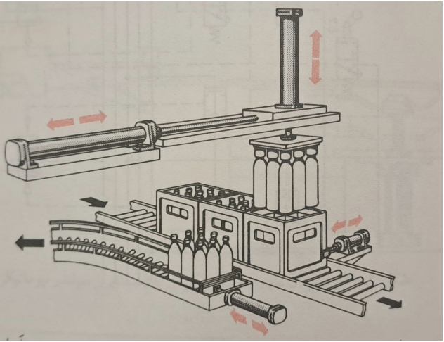
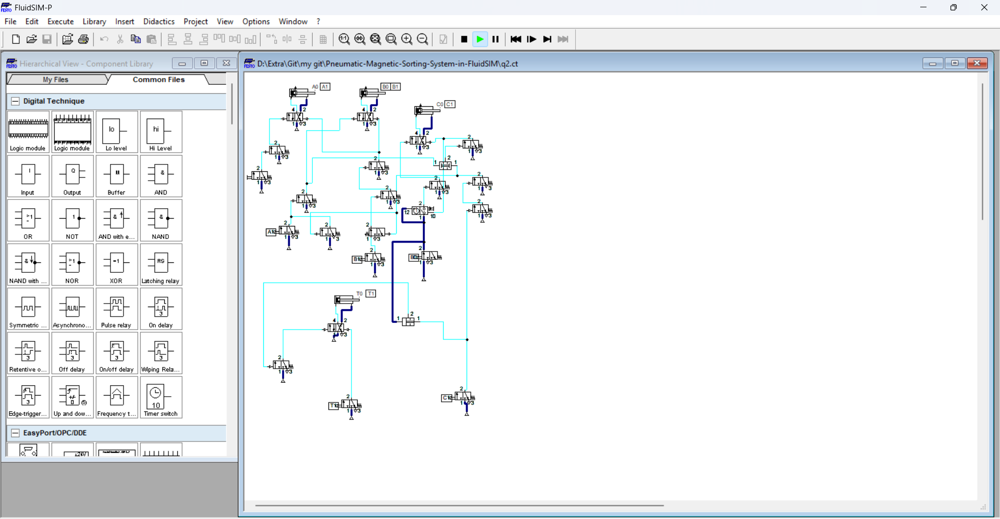

# Pneumatic Circuit for Sorting System

## Description
This project demonstrates a pneumatic circuit designed to automate the sorting process of bottles using FluidSIM. The system sequentially handles bottles on a conveyor belt, guiding them to the next step with precision and efficiency. The process incorporates multiple cylinders and a counter to ensure smooth operation and avoid trapped air.

## Operation Description

### Step 1: Start and Hold
Pressing the **Start** button activates the 4/2 valve and triggers **Cylinder A**, which acts as a holder to secure the box containing the bottles.  
Although the problem statement refers to "holders" in plural, the design assumes a single holding cylinder (as shown in the schematic).

### Step 2: Vertical Pickup
Once **Cylinder A** is active, **Cylinder B** is triggered.  
Cylinder B, moving vertically, lowers to pick up the bottles using suction or magnetic attraction.  
After securing the bottles, **Cylinder A** and **Cylinder B** simultaneously retract to their initial positions.

### Step 3: Horizontal Transfer
After **Cylinder B** returns to its initial position, **Cylinder C** is activated.  
Cylinder C pushes Cylinder B (and the bottles) toward the secondary conveyor belt.  
Once **Cylinder C** fully extends and the bottles are transferred to the second conveyor, **Cylinder B** lowers to place the bottles on the conveyor.

### Step 4: Conveyor Alignment and Reset
After placing the bottles on the secondary conveyor, **Cylinder T** is triggered.  
Cylinder T pushes the entire box forward, preparing it for the next cycle.  
Meanwhile, **Cylinder B** retracts and moves upward, and **Cylinder C** also retracts.  
This resets all cylinders to their initial positions, completing one full cycle.

### Step 5: Cycle Repeat
Pressing the **Start** button again initiates the process without any trapped air.  
A counter is integrated into the circuit to ensure synchronization between the actions of **Cylinders B** and **C**. The counter helps prevent trapped air and guarantees smooth, parallel operation.

## Notes
To avoid air trapping, an alternative CASCODE circuit could have been employed, but the counter solution was chosen for simplicity and efficiency.

## Project Files
- **FluidSIM project file**: Contains the pneumatic circuit design.
- **Operation diagrams**: Visual representation of each step.

## Features
- Fully automated pneumatic sorting system.
- Sequential and parallel operation for optimized performance.
- Integrated counter to ensure system reliability.
